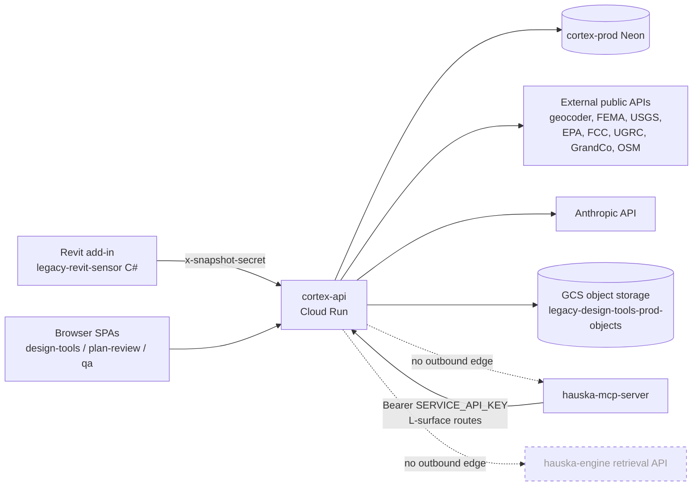

# Cortex QA WS-A data-source audit (WSA.1)

Read-only audit of what each of four Cortex surfaces reads from and writes to,
post-cutover (cortex-api on Cloud Run, cortex-prod Neon). This is the WSA.1
deliverable; it gates WSA.2 through WSA.5 and hands off to the planner for the
QA-05 full architecture diagram.

All file and line references are against `legacy-design-tools` `origin/main`
at commit `d8f3bef`.

> Revision note (2026-05-20). This audit was first written against a local
> checkout that was 12 commits behind `origin/main`. It has been re-verified
> against `origin/main` `d8f3bef`. The 13 files the four-surface trace rests on
> (`codes.ts`, `chat.ts`, `generateLayers.ts`, `snapshots.ts`, `match.ts`,
> `sheets.ts`, `ifcIngest.ts`, `objectStorage.ts`, `audienceGuards.ts`,
> `session.ts`, `snapshotSecret.ts`, `jurisdictions.ts`, `orchestrator.ts`) are
> byte-identical between the stale base and `origin/main`, so the per-surface
> tables and the WSA.3 / WSA.4 / WSA.5 findings stand unchanged. The Headline
> finding below was rewritten: `origin/main` carries an L-surface (PRs #44-46,
> #51) the stale checkout did not, and the original "zero MCP integration"
> claim was wrong.

## Headline finding

cortex-api exposes an **inbound** service-token surface that the Hauska MCP
Server calls; cortex-api itself makes **no outbound** call to the MCP server or
the hauska-engine retrieval API. The integration is one-directional: MCP
server to cortex-api.

The inbound surface is the Cortex L-surface (L1-L6), added by Lane C.4
(PRs #44-46, #51). Routes `/engagements/:id/response-tasks`,
`/sheets/:id/content-extraction`, `/engagements/:id/deliverable-letters`,
`/detail-callout-specs`, `/product-spec-references`, and the L6 render routes
are guarded by `requireServiceToken` / `requireServiceTokenOrSession`
([middlewares/serviceAuth.ts](../artifacts/api-server/src/middlewares/serviceAuth.ts)).
That middleware validates `Authorization: Bearer <token>` against the
`SERVICE_API_KEY` env var ([lib/serviceToken.ts](../artifacts/api-server/src/lib/serviceToken.ts)).
Per the `serviceAuth.ts` docstring, the bearer caller is cc-agent-M's
hauska-mcp-server, which sends the token from its own `LEGACY_BACKEND_API_KEY`
env var; the two secrets must match (this is the runbook Stage 0 "L-surface
bearer-auth" item). `requireServiceTokenOrSession` is dual-path: a bearer
header must be valid, and a request with no `Authorization` header falls
through to the browser-session path so the Cortex SPAs can call the same
L-routes.

So there IS an MCP integration, but it is the MCP server reaching into
cortex-api, not cortex-api reaching out. cortex-api has no MCP client, no
`HAUSKA_BACKEND_URL` consumer, and no `X-Hauska-Key` consumer (the MCP server's
own auth header is irrelevant here — cortex-api is the callee).

For the four QA surfaces this audit covers, cortex-api remains self-contained.
None of Code Library, site-context, in-app chat, or the Revit/IFC path touches
the MCP server or hauska-engine. Each depends only on:

- cortex-prod Neon (`DEPLOYMENT_DATABASE_URL`, Secret Manager v2),
- a fixed set of external public APIs (geocoder, FEMA, USGS, EPA, FCC, ArcGIS
  hosts, OSM Overpass),
- the Anthropic API (`AI_INTEGRATIONS_ANTHROPIC_API_KEY`),
- GCS object storage (`legacy-design-tools-prod-objects`, Cloud Run ADC).

This still refutes the WSA.5 working hypothesis. The dispatch assumed Code
Library might read the MCP server with a public-tier key and a wrong auth
header. It does not — Code Library reads a cortex-prod-local table
(`codes.ts`, see QA-13 below). The L-surface is a separate set of routes and
plays no part in Code Library, warmup, or jurisdiction visibility.

## Per-surface data-flow table

| Surface | FE entry | API endpoint(s) | Resolves to | Auth |
|---|---|---|---|---|
| (a) Code Library | `artifacts/design-tools/src/pages/CodeLibrary.tsx` | `GET /api/codes/jurisdictions`, `/api/codes/jurisdictions/:key/atoms`, `/api/codes/atoms`, `/api/codes/atoms/:id`, `/api/codes/warmup-status/:key`, `POST /api/codes/warmup/:key`, `POST /api/codes/embeddings/backfill` | cortex-prod Neon tables `code_atoms`, `code_atom_sources`, `code_atom_fetch_queue` via `@workspace/db`. Jurisdiction list is a static code registry, not DB-derived. | GET: none. `warmup` + `backfill`: `requireArchitectAudience` (requires `session.audience === "internal"`). |
| (b) Site-context layers | `EngagementDetail.tsx` Site Context tab | `POST /api/engagements/:id/generate-layers` | `@workspace/adapters` runs adapters against external public APIs; results written as `briefing_sources` rows in cortex-prod; adapter responses cached in cortex-prod (`adapter_response_cache`). Geocode via `@workspace/site-context/server`. | None (session middleware runs; route has no audience guard). |
| (c) In-app Claude chat | `artifacts/design-tools/src/components/ClaudeChat.tsx` | `POST /api/chat` (SSE stream) | Anthropic API (`api.anthropic.com`, model `claude-sonnet-4-6`) via `@workspace/integrations-anthropic-ai`. Reads engagement/snapshot/sheets and `code_atoms` from cortex-prod. | None (chat scope derived from session; production session is always anonymous `audience:"user"`). |
| (d) Revit add-in snapshot + IFC | C# add-in `legacy-revit-sensor` (separate repo) | `POST /api/engagements/match`, `POST /api/snapshots`, `POST /api/snapshots/:id/sheets`, `POST /api/snapshots/:id/ifc` | cortex-prod Neon (`engagements`, `snapshots`, `sheets`, `snapshot_ifc_files`, `materializable_elements`, `bim_models`). Sheet PNGs are bytea columns in the DB. IFC raw blob + consolidated GLB go to GCS object storage. | `x-snapshot-secret` shared secret (`SNAPSHOT_SECRET`). |

Per-surface detail with file and line references follows.

### Surface (a) — Code Library page

Routes: `artifacts/api-server/src/routes/codes.ts`.

The read endpoints query cortex-prod directly. `GET /api/codes/jurisdictions`
([codes.ts:79](../artifacts/api-server/src/routes/codes.ts#L79)) iterates the
static jurisdiction registry and, for each, runs `jurisdictionAtomCounts()`
([codes.ts:37](../artifacts/api-server/src/routes/codes.ts#L37)) which is a
`count(*)` over the `code_atoms` table grouped by `code_book`/`edition`.
`/api/codes/atoms` ([codes.ts:191](../artifacts/api-server/src/routes/codes.ts#L191))
and `/api/codes/jurisdictions/:key/atoms`
([codes.ts:112](../artifacts/api-server/src/routes/codes.ts#L112)) select rows
joined to `code_atom_sources`. There is no outbound call to any service. The
Code Library is a pure cortex-prod-local view.

The jurisdiction list itself comes from a static code registry, not the DB.
`JURISDICTIONS` in
[lib/codes/src/jurisdictions.ts:37](../lib/codes/src/jurisdictions.ts#L37)
contains exactly two entries: `grand_county_ut` and `bastrop_tx`. `bastrop_tx`
is the City of Bastrop (Municode client id 1169), not Bastrop County. The Code
Library can only ever display jurisdictions present in this object.

`POST /api/codes/warmup/:key` ([codes.ts:487](../artifacts/api-server/src/routes/codes.ts#L487))
is the "Warm up now" action. Its first line is
`requireArchitectAudience(req, res, CODES_WARMUP_AUDIENCE_ERROR)`. The error
constant is `codes_warmup_requires_internal_audience`
([codes.ts:18](../artifacts/api-server/src/routes/codes.ts#L18)); the QA report's
`codes_warmup_requires_internal` is the same 403, abbreviated. See the QA-13
section for why this always fails in production.

### Surface (b) — Site-context layer generation

Route: `artifacts/api-server/src/routes/generateLayers.ts`,
`POST /api/engagements/:id/generate-layers`.

The route resolves the engagement's jurisdiction and coordinates from cortex-prod
([generateLayers.ts:397](../artifacts/api-server/src/routes/generateLayers.ts#L397)),
filters `ALL_ADAPTERS` ([generateLayers.ts:478](../artifacts/api-server/src/routes/generateLayers.ts#L478)),
and runs them through `@workspace/adapters`' `runAdapters`
([generateLayers.ts:543](../artifacts/api-server/src/routes/generateLayers.ts#L543)).
Each adapter calls an external public API. Successful results are persisted as
`briefing_sources` rows in a cortex-prod transaction
([generateLayers.ts:569](../artifacts/api-server/src/routes/generateLayers.ts#L569)).
A Postgres-backed result cache (`createAdapterResponseCache`,
[generateLayers.ts:525](../artifacts/api-server/src/routes/generateLayers.ts#L525))
fronts the federal tier.

External APIs reached by the adapter set (`lib/adapters/src`):

| Adapter key | Tier | Upstream host | File |
|---|---|---|---|
| `fema:nfhl` | federal | FEMA NFHL ArcGIS | `federal/fema-nfhl.ts` |
| `usgs:ned` (USGS EPQS) | federal | USGS elevation point query | `federal/usgs-ned.ts` |
| `epa:ejscreen` | federal | `ejscreen.epa.gov/mapper/ejscreenRESTbroker3.aspx` | `federal/epa-ejscreen.ts` |
| `fcc:broadband` | federal | `broadbandmap.fcc.gov` | `federal/fcc-broadband.ts` |
| `ugrc:dem`, `ugrc:parcels`, `ugrc:address-points` | state | `services1.arcgis.com/99lidPhWCzftIe9K` (UGRC) | `state/utah.ts` |
| `grand-county-ut:parcels`, `:zoning`, `:roads` | local | `gis.grandcountyutah.net`, OSM Overpass fallback | `local/grand-county-ut.ts` |

The runner enforces a per-adapter timeout, default 15s
([runner.ts:36](../lib/adapters/src/runner.ts#L36)), via an `AbortController`.
The generate-layers route does not pass a caller `signal`
([generateLayers.ts:443](../artifacts/api-server/src/routes/generateLayers.ts#L443)),
so the only abort source is that 15s timer. See WSA.4 for why this matters to
the "cancelled by the caller" failures.

Geocoding is `geocodeAddress` from `@workspace/site-context/server`
(`lib/site-context/src/server/geocode.ts`), called on the snapshot-create path
([snapshots.ts:462](../artifacts/api-server/src/routes/snapshots.ts#L462)) — a
further external dependency.

### Surface (c) — In-app Claude chat panel

Route: `artifacts/api-server/src/routes/chat.ts`, `POST /api/chat`.

The chat route loads the engagement, latest snapshot, referenced sheets and
retrieved `code_atoms` from cortex-prod, builds a prompt, and streams the
response from the Anthropic API: `anthropic.messages.stream({ model:
"claude-sonnet-4-6", ... })`
([chat.ts:747](../artifacts/api-server/src/routes/chat.ts#L747)). `anthropic` is
the client from `@workspace/integrations-anthropic-ai`; the API key is
`AI_INTEGRATIONS_ANTHROPIC_API_KEY` from Secret Manager.

Code-atom context is retrieved via `retrieveAtomsForQuestion` and
`getAtomsByIds` from `@workspace/codes`
([chat.ts:596](../artifacts/api-server/src/routes/chat.ts#L596),
[chat.ts:586](../artifacts/api-server/src/routes/chat.ts#L586)) — both query the
cortex-prod `code_atoms` table.

The route is strictly read-only: it emits a `text/event-stream` of text deltas
and ends. There is no tool use, no function calling, no write-back path. This
confirms backlog Finding 3: the in-app agent works but cannot create tasks or
write platform state. Giving it write-back is WS-C scope, not WS-A.

### Surface (d) — Revit add-in snapshot and IFC push path

The add-in is a separate C# repo (`legacy-revit-sensor`); see WSA.2. Its four
wire endpoints all live in this repo's api-server and authenticate with the
`x-snapshot-secret` shared-secret header.

`POST /api/engagements/match` ([match.ts:82](../artifacts/api-server/src/routes/match.ts#L82))
resolves an engagement by GUID, path, or name from cortex-prod.

`POST /api/snapshots` ([snapshots.ts:562](../artifacts/api-server/src/routes/snapshots.ts#L562))
inserts `engagements` and `snapshots` rows. On the create-new branch it fires a
background geocode + jurisdiction warmup enqueue
([snapshots.ts:456](../artifacts/api-server/src/routes/snapshots.ts#L456)) and an
auto briefing kickoff.

`POST /api/snapshots/:id/sheets` ([sheets.ts](../artifacts/api-server/src/routes/sheets.ts))
stores sheet PNGs as `thumbnailPng`/`fullPng` bytea columns in cortex-prod. It
does not touch object storage.

`POST /api/snapshots/:id/ifc` ([snapshots.ts:989](../artifacts/api-server/src/routes/snapshots.ts#L989))
delegates to `ingestSnapshotIfc` in
[lib/ifcIngest.ts:237](../artifacts/api-server/src/lib/ifcIngest.ts#L237). The
IFC path writes to cortex-prod (`snapshot_ifc_files`, `materializable_elements`,
`bim_models`) and writes two blobs (raw `.ifc`, consolidated `.glb`) to GCS
object storage via `ObjectStorageService.uploadObjectEntityFromBuffer`
([objectStorage.ts:143](../artifacts/api-server/src/lib/objectStorage.ts#L143)).
This is the only one of the four add-in endpoints that depends on object
storage. See WSA.3.

## QA-13 settled

Question from the dispatch: does Code Library read a cortex-prod-local table, or
the MCP server? Answer: a cortex-prod-local table. `code_atoms`,
`code_atom_sources`, `code_atom_fetch_queue`, queried directly through
`@workspace/db`. There is no MCP call, no product tier, no `X-Hauska-Key`. The
second hypothesis in backlog Finding 2 (MCP server with a public-tier key) is
refuted. The first hypothesis (a cortex-prod-local table that never received the
substrate ingest) is correct.

Grand County shows 290 atoms because the cortex-prod `code_atoms` table holds a
Grand County corpus, migrated intact during the cutover (runbook Stage 9 records
that the full data migration succeeded). The match with the substrate corpus
count of 290 is a coincidence of the same jurisdiction having the same coverage
in two independent systems. The Code Library is not reading the substrate.

## Elgin and Bastrop County: not reachable by the Cortex app

Confirmed absent. Reasons, in order:

1. Neither is in the `JURISDICTIONS` registry
   ([lib/codes/src/jurisdictions.ts:37](../lib/codes/src/jurisdictions.ts#L37)).
   Only `grand_county_ut` and `bastrop_tx` (City of Bastrop) exist. The Code
   Library cannot list a jurisdiction that is not in this object, and warmup
   would 404 (`getJurisdiction(key)` returns null) before it even reached the
   audience guard.
2. There are no `code_atom_sources` rows or ingest adapters for Elgin's Municode
   or Bastrop County's documents on the Cortex side.
3. The Sync 4.5 atoms for Elgin (210, platform-internal) and Bastrop County (17,
   platform-internal) were produced into the Hauska substrate corpus
   (`@hauska/atom-contract`, hauska-engine's separate Neon project). The Cortex
   app does not consume that corpus through any path.

So the substrate atoms exist, but nowhere the Cortex app can reach. Restoring
their visibility in Code Library is an architecture decision, not a wiring fix.
See WSA.5.

## The warmup 403 root cause

`requireArchitectAudience` ([lib/audienceGuards.ts:29](../artifacts/api-server/src/lib/audienceGuards.ts#L29))
returns a 403 unless `req.session.audience === "internal"`.

`sessionMiddleware` ([middlewares/session.ts:238](../artifacts/api-server/src/middlewares/session.ts#L238))
is fail-closed in production. When `NODE_ENV === "production"` it sets
`req.session` to the frozen `ANONYMOUS_APPLICANT` (`audience: "user"`) and
returns. The `pr_session` cookie and the `x-audience` override header are honored
only when `NODE_ENV !== "production"`. There is no production path that yields
`audience: "internal"`.

Therefore `POST /api/codes/warmup/:key` and `POST /api/codes/embeddings/backfill`
return 403 on every production call. This is by design of the current
auth-stub, not a cutover regression and not an MCP-key problem. The "Warm up
now" button is structurally unreachable on Cloud Run.

## Cortex-side data-flow diagram (draft for QA-05)

```
                         ┌──────────────────────────────────────────┐
   Revit add-in          │            cortex-api (Cloud Run)         │
   legacy-revit-sensor   │   legacy-design-tools-prod, us-central1   │
   (separate C# repo) ──▶│   rev cortex-api-00003-xal                │
   x-snapshot-secret     │                                          │
                         │  routes: codes, generateLayers, chat,    │
   Browser SPAs          │  snapshots, match, sheets, ...           │
   design-tools ────────▶│                                          │
   plan-review           └───┬───────────┬──────────┬──────────┬────┘
   qa                        │           │          │          │
                             │           │          │          │
                     ┌───────▼──┐  ┌─────▼─────┐ ┌──▼──────┐ ┌─▼────────────┐
                     │cortex-   │  │ external  │ │Anthropic│ │ GCS object   │
                     │prod Neon │  │ public    │ │  API    │ │ storage      │
                     │(us-east-1│  │ APIs      │ │api.anth-│ │ legacy-      │
                     │ Scale)   │  │           │ │ropic.com│ │ design-tools-│
                     │          │  │ geocoder  │ │         │ │ prod-objects │
                     │code_atoms│  │ FEMA NFHL │ │chat,    │ │ (Cloud Run   │
                     │briefing_ │  │ USGS EPQS │ │briefing,│ │  ADC)        │
                     │ sources  │  │ EPA EJScrn│ │findings,│ │              │
                     │engagement│  │ FCC NBM   │ │OCR      │ │ IFC blob,    │
                     │snapshots │  │ UGRC GIS  │ │         │ │ GLB bundle   │
                     │sheets    │  │ GrandCo   │ │         │ │              │
                     │ifc_files │  │  GIS      │ │         │ │              │
                     │mat_elem  │  │ OSM Over- │ │         │ │              │
                     │bim_models│  │  pass     │ │         │ │              │
                     └──────────┘  └───────────┘ └─────────┘ └──────────────┘

   INBOUND edge (one-directional):
     hauska-mcp-server ──Authorization: Bearer SERVICE_API_KEY──▶ cortex-api
       L-surface routes only: /response-tasks, /sheets/:id/content-extraction,
       /deliverable-letters, /detail-callout-specs, /product-spec-references,
       /deliverable-letter-renders. Guarded by requireServiceToken /
       requireServiceTokenOrSession (dual-path: bearer OR browser session).

   NO OUTBOUND edge from cortex-api to:
     - hauska-mcp-server  (no MCP client; the MCP server is the caller, not callee)
     - hauska-engine retrieval API  (HAUSKA_BACKEND_URL — no consumer in repo)

   cortex-api never calls the MCP server or hauska-engine. The four QA surfaces
   in this audit (Code Library, site-context, chat, Revit/IFC) have no path to
   either. Any future Code-Library-reads-substrate or chat-uses-MCP-tools design
   is net-new wiring, not a repair.
```

Mermaid form, for the planner's QA-05 assembly:



## Hand-off notes for WSA.2 to WSA.5

- WSA.2: the add-in backend URL is the per-workstation `ReplitUrl` setting in
  `legacy-revit-sensor`, not anything in this repo. Operator-fixable now; the
  C# repo needs a rename plus a default-value and dialog fix. Flag.
- WSA.3: the IFC 500 is one of three branches in `ingestSnapshotIfc`; the object
  storage write is the most cutover-suspicious. Needs Cloud Run logs to confirm.
- WSA.4: `ugrc:dem` 400 is a constructed-URL bug, fixed this session. The
  "cancelled by the caller" failures are the 15s server-side runner timeout.
- WSA.5: the warmup 403 and the missing jurisdictions are both architecture
  decisions, not wiring fixes. Flag.

## Carry-forward for QA-05

The QA-05 architecture diagram should record the MCP relationship precisely,
because it is asymmetric. The Hauska MCP Server calls cortex-api's L-surface
(L1-L6) inbound over a `SERVICE_API_KEY` bearer token. cortex-api never calls
the MCP server or hauska-engine outbound. So the Cortex product surface is a
data provider to the MCP layer, not a consumer of the Hauska catalog.

The four QA surfaces in this audit consume neither the MCP server nor the
substrate. Code Library reads cortex-prod-local `code_atoms`; the in-app agent
calls Anthropic directly. The "same atom graph" relationship between Cortex
atoms and Hauska catalog atoms described in `40_design_accelerator.md` is
conceptual for those surfaces, not wired. If the product intent is for Code
Library or the in-app agent to read the Hauska catalog, that is a roadmap item
(the Cortex MCP retrofit, Phase 5 per `28_mcp_first_product_design.md`), and
QA-13 / QA-07 should be triaged against that, not as cutover-tail bugs.
