# SmartCity OS — UI Audit

**Date:** May 2, 2026
**Scope:** What is currently shipped in the deployed UI for the two end-user portals.
**Apps audited:**

| Portal | Audience | Mounted at |
|---|---|---|
| **Design Tools** (`design-tools`) | Architects (firms designing buildings) | `/` |
| **Plan Review** (`plan-review`) | Reviewers (jurisdiction staff approving plans) | `/plan-review/` |

A third artifact, `api-server`, sits at `/api` and backs both portals. It has no UI of its own and is excluded from this audit.

---

## Top-line summary

- **Both portals share a chrome and design system** (left nav, dark theme, cyan accent, monospaced section labels) built on `lib/portal-ui`. The visual language is consistent across the two apps.
- **The architect portal is the most fully built.** Engagement creation, snapshot ingestion, code library browsing, and the Claude side panel are all wired to live data.
- **The reviewer portal is a working shell with mocked data in several places.** The Inbox, Saved Findings, and Submittal Detail show submittal IDs (e.g. `SUB-2026-0142`) that do not exist in the live submissions table — they're rendered from fixture/demo content. Engagement Detail and Sheets pages, by contrast, read live data.
- **Several reviewer surfaces are intentional stubs**: `Code Library`, `In Review`, `Approved`, `Rejected`, `Compliance`, `Firms`, `Projects`, `Integrations` all render a "Coming soon — this view is in design" placeholder.
- **Auth-gated views fail closed correctly.** `/settings` (architect) shows "Sign in required"; `/users` (reviewer admin) shows "Access denied — you need the `users:manage` permission."

---

## 1. Architect portal — `Design Tools`

Left-nav groups: **Workspace** · **Projects** (recent engagements) · **Dev** (developer-only tools).

### 1.1 Projects list — `/`

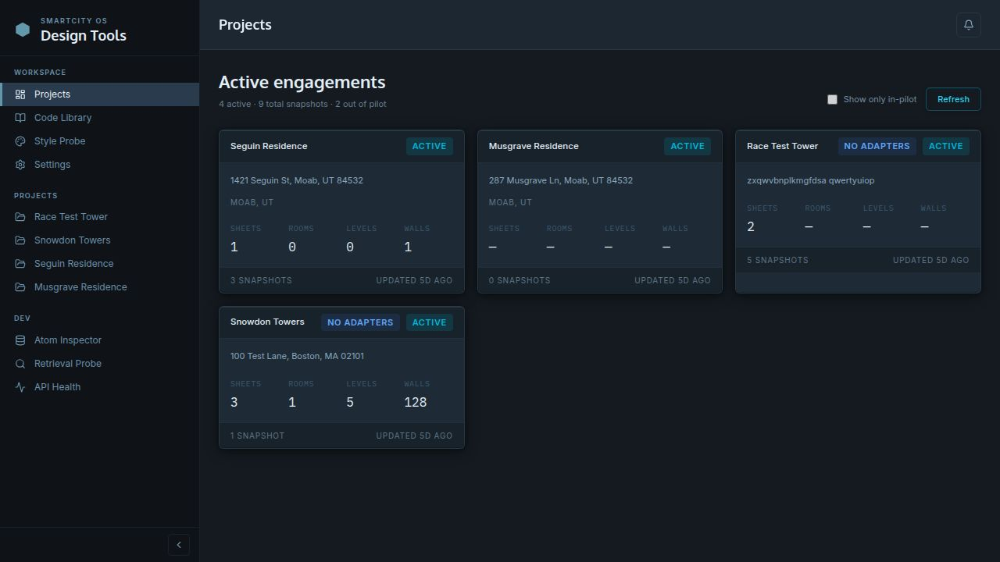

- Lists every engagement the firm owns. Snowdon Towers, Race Test Tower, Seguin Residence, Musgrave Residence are visible.
- Each row shows project name, address, status pill (`ACTIVE`/`ARCHIVED`), and last-activity timestamp.
- Top-right button: **+ New project**.
- Behavior verified: clicking a row deep-links to `/engagements/:id`.

### 1.2 Engagement detail — `/engagements/:id`

The detail page has **6 tabs** addressable via `?tab=…`. The Claude AI side-panel ("Ask about this model") is docked on the right of every tab. A **Reviewer requests** banner sits above the tabs; it shows a loading state in our captures (no requests outstanding for this engagement).

#### Snapshots tab (default)
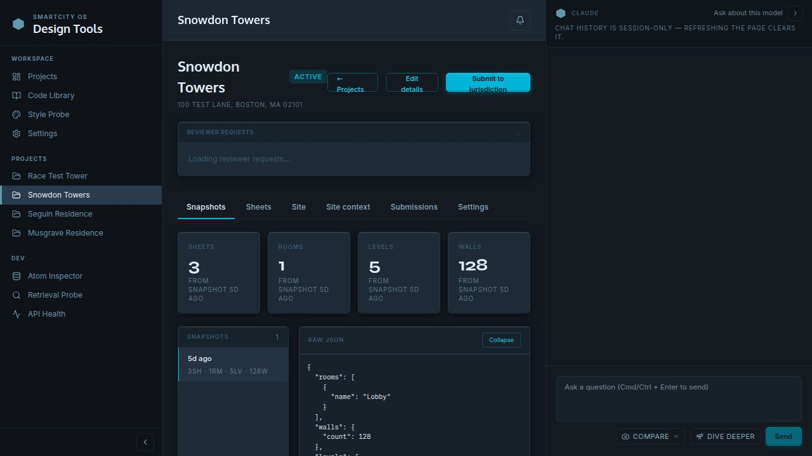

Timeline of every Revit snapshot pushed from the add-in. For Snowdon Towers we see 1 snapshot with 5 levels and 128 walls. Each entry shows snapshot ID, ingest time, level/wall counts, and a "Compare with…" affordance.

#### Sheets tab
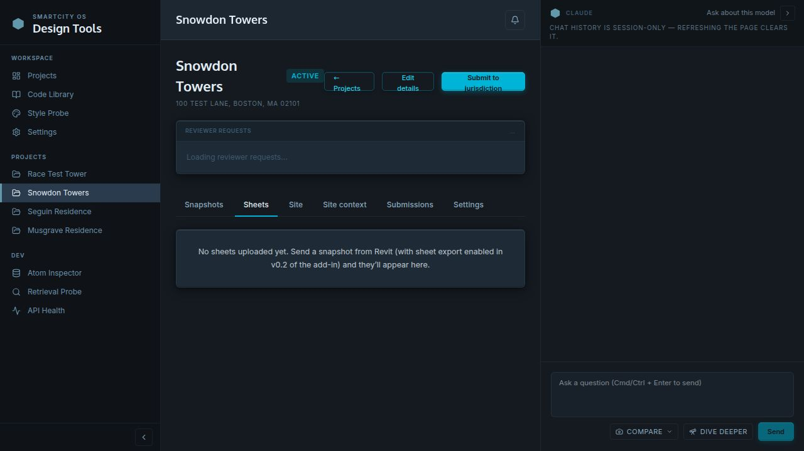

Empty state: *"No sheets uploaded yet. Send a snapshot from Revit (with sheet export enabled in v0.2 of the add-in) and they'll appear here."* Working as designed — Snowdon's snapshot predates v0.2 of the add-in.

#### Site tab
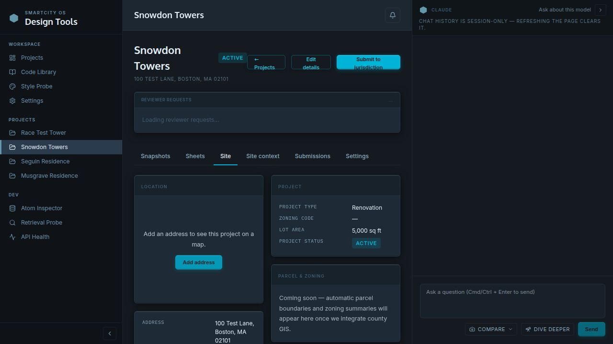

Two-column layout. **Location** card shows the parsed address (100 Test Lane, Boston, MA 02101) with an "Add address to see this project on a map" CTA where the map should render. **Project** card shows project type (Renovation), zoning code (—), lot area (5,000 sq ft), and project status. **Parcel & zoning** card is a "Coming soon" stub for county GIS integration.

#### Site context tab
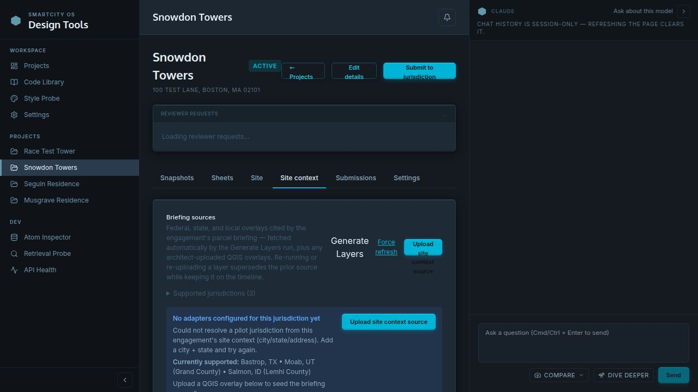

The most ambitious tab. **Briefing sources** panel manages the federal/state/local code overlays cited by the parcel briefing — auto-fetched by the "Generate Layers" run, plus manually uploaded QGIS overlays. Snowdon hits a "No adapters configured for this jurisdiction yet" warning because Boston isn't in the supported list (currently Bastrop TX, Moab UT, Salmon ID). This is a real product gap surfaced clearly to the user.

#### Submissions tab
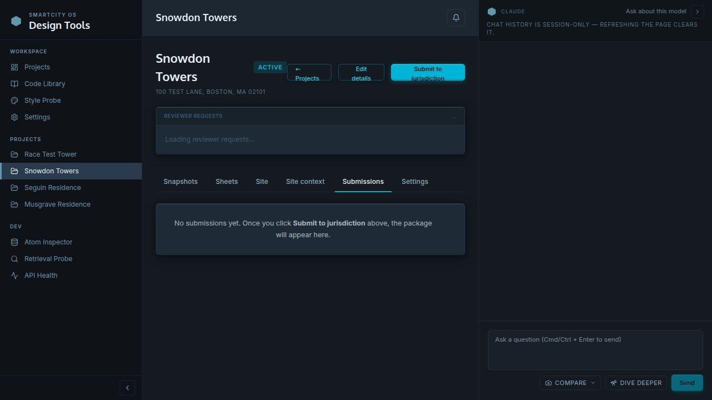

Empty state: *"No submissions yet. Once you click Submit to jurisdiction above, the package will appear here."*

#### Settings tab
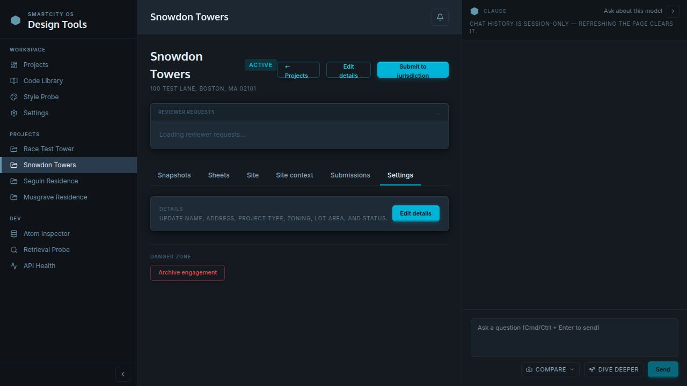

**Details** card with an "Edit details" button (name, address, project type, zoning, lot area, status). **Danger zone** with a single destructive **Archive engagement** button.

### 1.3 Code Library — `/code`

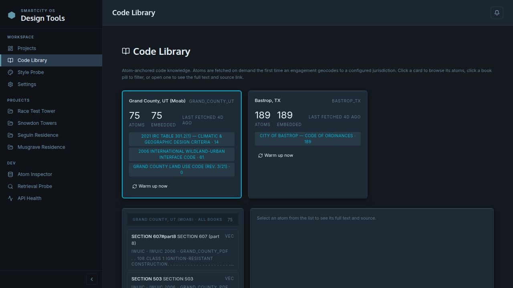

Per-jurisdiction browser of code atoms (sections, chapters, parts). Filters: jurisdiction, code book, edition, source, "embedded" yes/no, and a free-text section search. Snowdon sample shows IBC-2018 sections for Suffolk County MA. Each row has a **vec** badge (vector embedding present) and a fetched-at timestamp. This is the consumer-facing version of the Atom Inspector dev view.

### 1.4 Style Probe — `/style-probe`

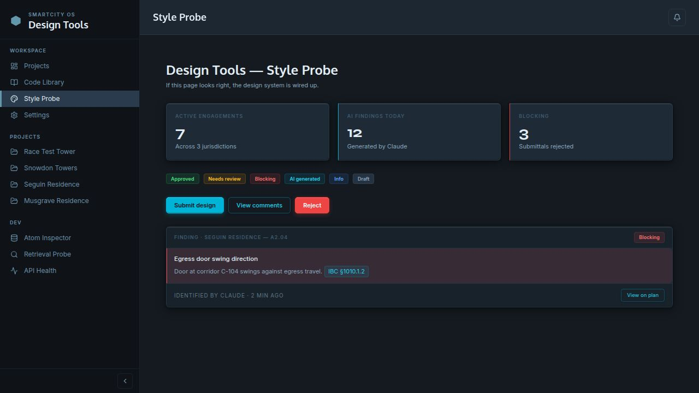

Design-system smoke test page. Shows KPI tiles, badge/pill swatches across all severity colors, button variants, and a finished-look "Finding" card. Useful as a regression target when the design system changes.

### 1.5 Settings — `/settings`

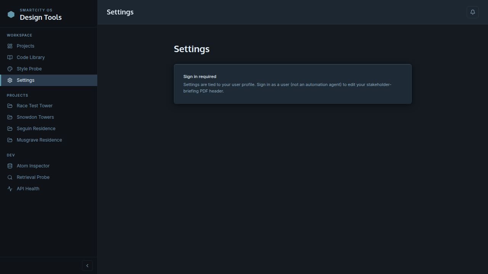

Renders **"Sign in required"** for unauthenticated sessions. Functioning as intended; the sign-in flow itself was not exercised in this audit.

### 1.6 Dev tools (gated to dev users)

#### API Health — `/health`
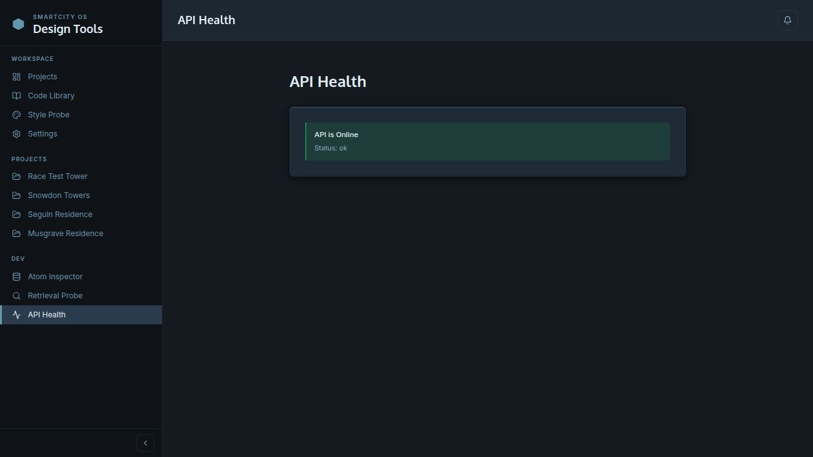
Plain status panel showing the API server is reachable and reporting `ok`.

#### Atom Inspector — `/dev/atoms`
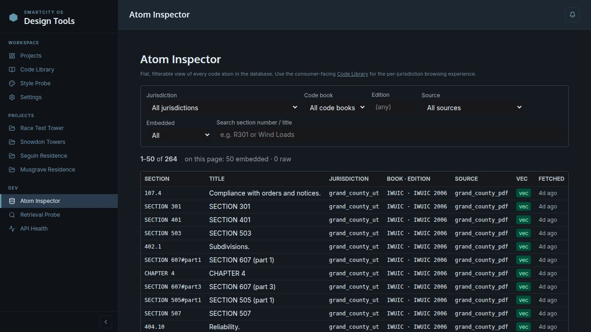
Flat, paginated, filterable view of every code atom in the database (264 total in the current dataset). Same filters as the public Code Library plus per-row source attribution. Built for engineers debugging the corpus.

#### Retrieval Probe — `/dev/atoms/probe`
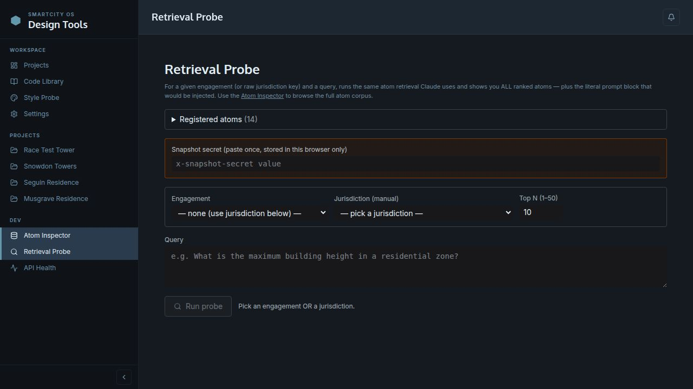
Lets a developer paste a snapshot secret, pick an engagement (or raw jurisdiction), enter a query, and see exactly which atoms Claude's RAG layer would inject into its prompt — plus the literal prompt block. **14 atoms registered** for the current build.

---

## 2. Reviewer portal — `Plan Review`

Left-nav groups: **Submittals** · **AI Reviewer** · **Architect Portal** (cross-links to Design Tools surfaces) · **Dev**.

### 2.1 Inbox / Review Console — `/`

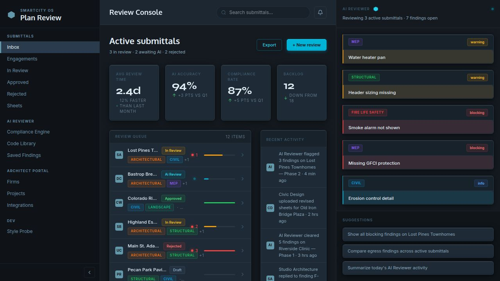

The reviewer's home page. Shows three KPI tiles (`AVG REVIEW TIME 2.4d`, `AI ACCURACY 94%`, `BLOCKING FINDINGS 28`) followed by a queue of submittals awaiting triage. Each row shows submittal code (`SUB-2026-0142` …), engagement name, jurisdiction, age, and status pill. **Note:** these submittals are demo data — they do not correspond to rows in the live `submissions` table.

### 2.2 Engagements list — `/engagements`

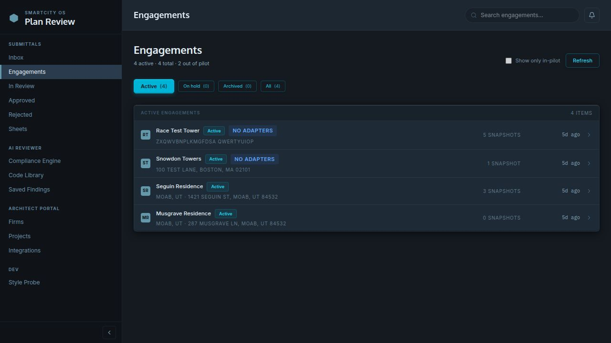

Live list of engagements pulled from the same backend the architect portal uses. Reviewer-side this is a read-only browse view (no "+ New").

### 2.3 Engagement detail — `/engagements/:id`

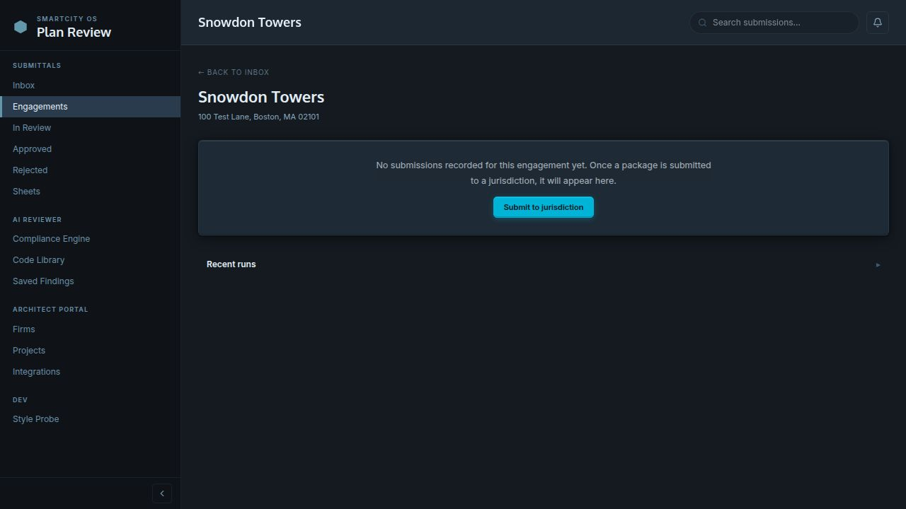

For Snowdon Towers: address, "No submissions recorded for this engagement yet" empty state, **Submit to jurisdiction** CTA, and a collapsed **Recent runs** section. This is a slimmer view than the architect's engagement detail — it omits snapshots, sheets, site, and site-context tabs.

### 2.4 Sheets — `/sheets`

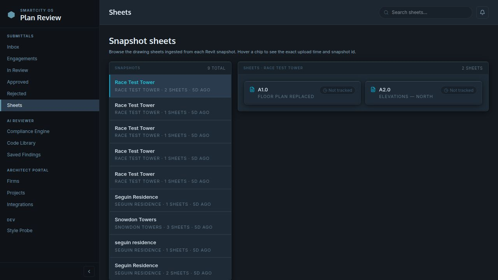

Cross-engagement snapshot/sheet browser. Left rail lists every snapshot in the system (9 total, grouped by project); right pane shows the sheets in the selected snapshot with `Not tracked` chips when no review state is attached.

### 2.5 Saved Findings — `/findings`

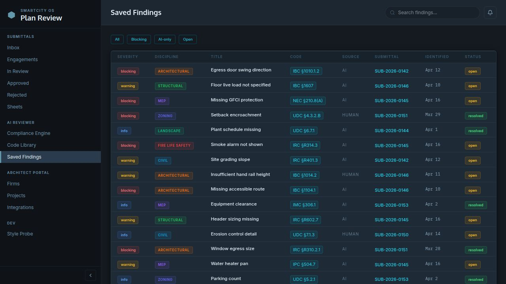

Library of every Claude-generated finding across all submittals. Each card shows discipline (Architectural / Structural / MEP / etc.), severity (`blocking`/`warning`/`info`), the cited code section, and the originating submittal ID. Filterable by discipline, severity, and free text.

### 2.6 Code Library — `/code` *(stub)*

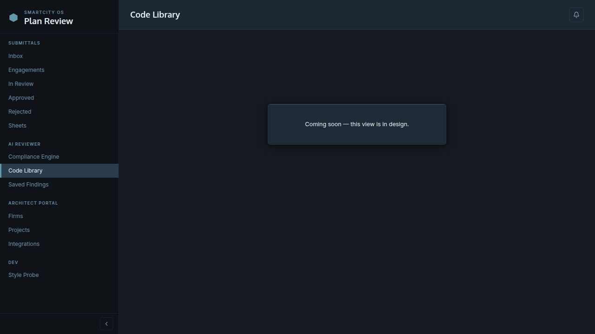

Renders **"Coming soon — this view is in design."** Architect portal already has a working version; reviewer-side has not been ported.

### 2.7 Users (admin) — `/users`

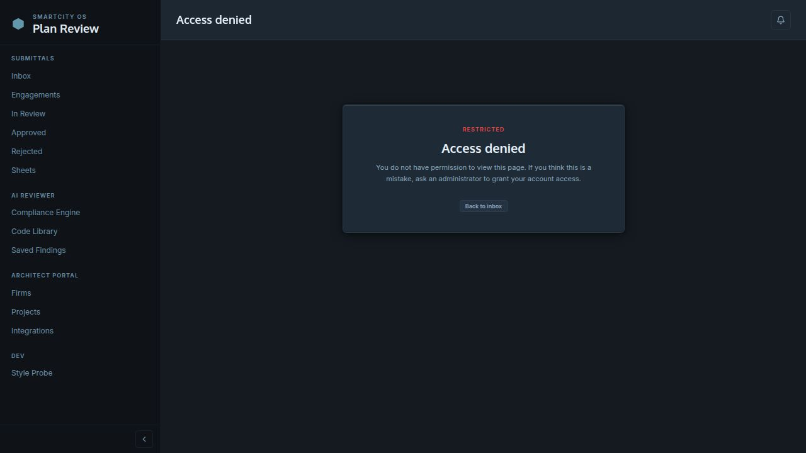

Renders **"Access denied — you need the `users:manage` permission."** Working as designed for non-admin sessions; the admin variant was not exercised in this audit.

### 2.8 Style Probe — `/style-probe`

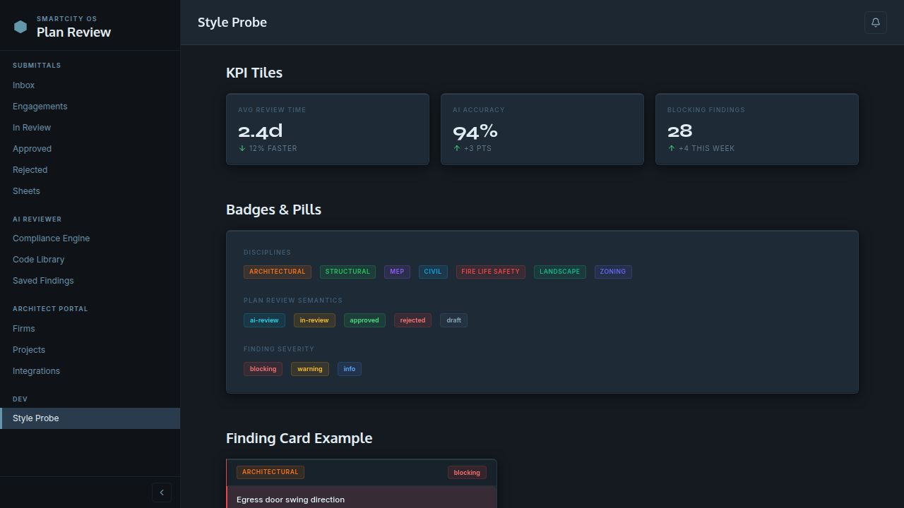

Reviewer-side design-system probe. Shows KPI tiles, discipline badges, plan-review status pills (`ai-review`/`in-review`/`approved`/`rejected`/`draft`), severity pills, and a sample Finding card.

### 2.9 Coming-Soon stubs

Several left-nav items route to a generic "Coming soon" placeholder:

| Route | Nav label | Group |
|---|---|---|
| `/in-review` | In Review | Submittals |
| `/approved` | Approved | Submittals |
| `/rejected` | Rejected | Submittals |
| `/compliance` | Compliance Engine | AI Reviewer |
| `/firms` | Firms | Architect Portal |
| `/projects` | Projects | Architect Portal |
| `/integrations` | Integrations | Architect Portal |

These ship in the nav so users discover the eventual feature set, but clicking any one lands on the same placeholder.

---

## 3. Cross-cutting observations

### What works well
- **Consistent chrome** across both portals — the same `DashboardLayout`, the same nav typography, the same iconography. A user moving between portals immediately knows where they are.
- **Empty states are written, not blank.** Every "no data yet" surface explains *why* it's empty and *what action* produces data.
- **Auth/permission failures fail closed and explain themselves.** "Sign in required" / "Access denied — you need `users:manage`."
- **The architect Engagement Detail page is the strongest screen** in either app — six purposeful tabs, a docked Claude panel, and a real submit-to-jurisdiction flow.

### Gaps to be aware of
- **Reviewer Inbox / Saved Findings / Submittal Detail run on demo data.** The submittal IDs displayed (`SUB-2026-0142`, etc.) have no rows in the live `submissions` table. Real submissions will need to flow end-to-end before these screens are demo-ready.
- **Seven left-nav links on the reviewer side go to a single "Coming soon" stub.** Consider hiding them until they ship or adding "(soon)" badges.
- **Site Context is jurisdiction-gated** — only Bastrop TX, Moab UT, and Salmon ID have adapters. Boston (where the seeded Snowdon Towers lives) hits the unsupported-jurisdiction path on first load.
- **"Add address to see this project on a map"** on the Site tab is a placeholder — there is no map renderer yet, even though the engagement already has a parsed address.
- **Parcel & zoning** card on the Site tab is an open "Coming soon — county GIS" stub.

### Dev-only surfaces
The Atom Inspector, Retrieval Probe, API Health, and both Style Probes are all currently reachable in the deployed bundle. They're useful internally but are not link-targeted from any user-facing page; they exist for support/debugging.

---

## Appendix — Screenshot index

All images live alongside this document in `attached_assets/ui-audit/`.

**Design Tools (architect portal):**
1. `design-tools-01-projects.jpg` — Projects list
2. `design-tools-02-engagement-snapshots.jpg` — Engagement detail / Snapshots tab
3. `design-tools-03-code-library.jpg` — Code Library
4. `design-tools-04-settings.jpg` — Settings (sign-in required)
5. `design-tools-05-health.jpg` — API Health
6. `design-tools-06-atom-inspector.jpg` — Atom Inspector (dev)
7. `design-tools-07-retrieval-probe.jpg` — Retrieval Probe (dev)
8. `design-tools-08-style-probe.jpg` — Style Probe
9. `design-tools-09-engagement-sheets.jpg` — Engagement / Sheets tab
10. `design-tools-10-engagement-site.jpg` — Engagement / Site tab
11. `design-tools-11-engagement-site-context.jpg` — Engagement / Site context tab
12. `design-tools-12-engagement-submissions.jpg` — Engagement / Submissions tab
13. `design-tools-13-engagement-settings.jpg` — Engagement / Settings tab

**Plan Review (reviewer portal):**
1. `plan-review-01-inbox.jpg` — Review Console / Inbox
2. `plan-review-02-engagements.jpg` — Engagements list
3. `plan-review-03-findings.jpg` — Saved Findings
4. `plan-review-04-users.jpg` — Users (access denied)
5. `plan-review-05-code.jpg` — Code Library (Coming Soon stub)
6. `plan-review-06-engagement-detail.jpg` — Engagement detail
7. `plan-review-07-sheets.jpg` — Sheets browser
8. `plan-review-08-style-probe.jpg` — Style Probe
